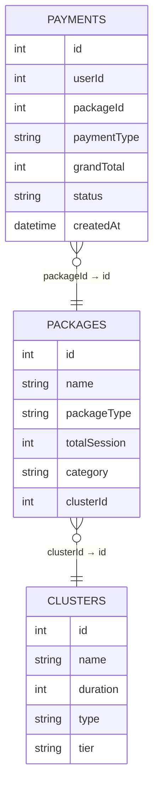

# 📊 Counseling Transaction SQL & Dashboard Analysis

Analisis data transaksi layanan konseling & meditasi menggunakan **PostgreSQL** untuk menjawab kebutuhan bisnis melalui query SQL, kemudian divisualisasikan menggunakan **Looker Studio** dalam bentuk dashboard interaktif yang mudah dipahami oleh stakeholder.

---

# 🏢 Business Context

Sebuah platform layanan **konseling** dan **meditasi** ingin memahami performa transaksi, perilaku pelanggan, serta kontribusi masing-masing layanan terhadap pendapatan perusahaan.

Data transaksi tersimpan dalam tiga tabel relasional sehingga diperlukan proses analisis menggunakan SQL untuk menjawab beberapa kebutuhan bisnis, kemudian menyajikan hasilnya dalam bentuk dashboard yang mudah dipahami oleh stakeholder non-teknis.

---

# 🎯 Project Objectives

Project ini bertujuan untuk:

- Mengidentifikasi pelanggan dengan total pengeluaran (spend) tertinggi.
- Menganalisis total penjualan setiap cluster layanan berdasarkan tahun.
- Menentukan paket dengan performa penjualan terbaik pada masing-masing jenis layanan.
- Menyajikan hasil analisis dalam dashboard interaktif sebagai pendukung pengambilan keputusan.

---

# 📂 Dataset Overview

Dataset berasal dari **Database.xlsx** yang terdiri dari tiga tabel relasional.

| Tabel | Jumlah Data | Deskripsi |
| --- | ---: | --- |
| Payments | 16.603 | Data transaksi pembayaran pelanggan |
| Packages | 81 | Master data paket layanan |
| Clusters | 18 | Master kategori layanan konseling |

### Ringkasan Dataset

- **Periode data:** Januari 2024 – Desember 2025
- **Total transaksi:** 16.603
- **Total pengguna unik:** 10.103
- **Database:** Relasional (3 tabel)

---

# 🗄 Database Schema



Hubungan antar tabel:

- **Payments** menyimpan seluruh transaksi pelanggan.
- **Packages** menyimpan informasi paket yang dibeli.
- **Clusters** menyimpan kategori layanan konseling.
- Analisis tertentu membutuhkan proses **multi-table JOIN** karena informasi cluster tidak tersedia langsung pada tabel transaksi.

---

# 🔄 Analytical Workflow

```text
📥 Database.xlsx
        │
        ▼
🔍 Data Understanding
        │
        ▼
🗂 Relationship Analysis
        │
        ▼
💻 SQL Query Development
        │
        ▼
📊 Business Analysis
        │
        ▼
📈 Dashboard Development
        │
        ▼
💡 Business Insights
```

---

# 📌 Business Question 1

## Siapa pelanggan dengan total pengeluaran (spend) tertinggi?

### Analytical Approach

- Menggunakan hanya transaksi dengan status **success**.
- Mengelompokkan transaksi berdasarkan **userId**.
- Menghitung total pengeluaran menggunakan **SUM(grandTotal)**.
- Mengurutkan berdasarkan total pengeluaran terbesar.
- Menampilkan **10 pelanggan teratas**.

### 🧠 SQL Techniques Used

- WHERE
- GROUP BY
- SUM()
- ORDER BY
- LIMIT

### 📄 SQL Solution

Implementasi SQL dapat dilihat pada file berikut:

➡️ **[(1) Top Spender User.sql](<SQL/(1) Top Spender User.sql>)**

### 💡 Business Insight

Analisis ini membantu mengidentifikasi pelanggan dengan nilai transaksi tertinggi yang berpotensi menjadi target program loyalitas maupun penawaran layanan premium.

---

# 📌 Business Question 2

## Bagaimana performa penjualan setiap cluster layanan pada tiap tahun?

### Analytical Approach

- Memfilter transaksi dengan status **success**.
- Melakukan **LEFT JOIN** antara tabel Payments, Packages, dan Clusters.
- Mengekstrak tahun transaksi menggunakan **EXTRACT(YEAR)**.
- Menghitung total penjualan setiap cluster.
- Mengurutkan berdasarkan tahun dan total penjualan.

### 🧠 SQL Techniques Used

- LEFT JOIN
- EXTRACT()
- GROUP BY
- SUM()
- ORDER BY

### 📄 SQL Solution

Implementasi SQL dapat dilihat pada file berikut:

➡️ **[(2) Total Penjualan per Cluster per Tahun.sql](<SQL/(2) Total Penjualan per Cluster per Tahun.sql>)**

### 💡 Business Insight

Analisis ini membantu perusahaan memahami kontribusi masing-masing cluster terhadap pendapatan setiap tahun sehingga dapat menjadi dasar evaluasi performa layanan.

---

# 📌 Business Question 3

## Paket apa saja yang memiliki penjualan tertinggi pada setiap jenis layanan?

### Analytical Approach

- Menghitung total penjualan setiap paket.
- Mengelompokkan berdasarkan **packageType**.
- Menggunakan **ROW_NUMBER()** untuk membuat ranking.
- Menampilkan tiga paket terbaik pada setiap kategori.

### 🧠 SQL Techniques Used

- Window Function
- ROW_NUMBER()
- PARTITION BY
- LEFT JOIN
- Subquery

### 📄 SQL Solution

Implementasi SQL dapat dilihat pada file berikut:

➡️ **[(3) Penjualan Paket Tertinggi per packageType.sql](<SQL/(3) Penjualan Paket Tertinggi per packageType.sql>)**

### 💡 Business Insight

Analisis ini membantu perusahaan mengetahui paket dengan performa terbaik pada masing-masing kategori layanan sehingga dapat menjadi acuan strategi promosi maupun pengembangan produk.

---

# 📊 Dashboard Overview

Seluruh hasil analisis kemudian divisualisasikan menggunakan **Looker Studio** agar lebih mudah dipahami oleh stakeholder non-teknis.

### 🔗 Interactive Dashboard

**https://datastudio.google.com/reporting/b8844fa7-c77a-48ba-86d6-f3c3573891c7**

---

# 🖼 Dashboard Preview

<p align="center">

</p>

---

# 📈 Dashboard Features

Dashboard menyajikan berbagai metrik utama, antara lain:

- Total Revenue
- Total Transactions
- Unique Users
- Average Transaction Value
- Revenue by Package Type
- Revenue by Cluster Type
- Transaction Status Distribution
- Top Users by Spending
- Interactive Filters (Tanggal, Status, Package Type, Counseling Type)

---

# 💡 Key Findings

Berdasarkan hasil analisis, diperoleh beberapa insight utama:

- Paket **konseling** menghasilkan revenue tertinggi dibandingkan kategori layanan lainnya.
- Sekitar **74,8% transaksi** berhasil diselesaikan, menunjukkan mayoritas pembayaran berstatus sukses.
- Revenue menunjukkan distribusi yang berbeda pada setiap cluster layanan.
- Sejumlah pelanggan memiliki total transaksi jauh di atas rata-rata sehingga berpotensi menjadi target program retensi pelanggan.

---

# 📂 Project Structure

Repository ini disusun untuk memisahkan dataset, query SQL, dan dashboard sehingga setiap tahapan analisis dapat ditelusuri dengan mudah.

```text
.
├── Data/
│   └── Database.xlsx
│
├── SQL/
│   ├── (1) Top Spender User.sql
│   ├── (2) Total Penjualan per Cluster per Tahun.sql
│   └── (3) Penjualan Paket Tertinggi per packageType.sql
│
├── Dashboard/
│   ├── assets/
│   │   └── dashboard_preview.png
│   └── looker_studio_link.md
│
├── .gitignore
├── LICENSE
└── README.md
```

---

# 🛠 Tools

| Category | Tools |
| --- | --- |
| Database | PostgreSQL |
| SQL Client | DBeaver |
| Dashboard | Looker Studio |
| Data Source | Google Sheets / Microsoft Excel |
| Version Control | Git & GitHub |

---

# 💼 Skills Demonstrated

### Data Analysis

- Exploratory Data Analysis (EDA)
- Business Analysis
- KPI Analysis
- Data Interpretation

### SQL

- Multi-table JOIN
- Data Aggregation
- Window Functions
- Ranking
- Filtering
- Data Transformation

### Business Intelligence

- Dashboard Development
- Interactive Reporting
- Data Visualization
- Business Reporting

---

# 🚀 Conclusion

Project ini merupakan studi kasus analisis data transaksi layanan konseling menggunakan **PostgreSQL** dan **Looker Studio**.

Melalui tiga business question yang diberikan, dilakukan proses analisis terhadap database relasional untuk menghasilkan insight bisnis yang relevan, kemudian divisualisasikan ke dalam dashboard interaktif agar lebih mudah dipahami oleh stakeholder.

Selain menunjukkan kemampuan menulis query SQL, project ini juga menggambarkan proses berpikir seorang Data Analyst dalam memahami kebutuhan bisnis, mengolah data relasional, serta menyampaikan hasil analisis dalam bentuk visual yang siap digunakan sebagai pendukung pengambilan keputusan.
