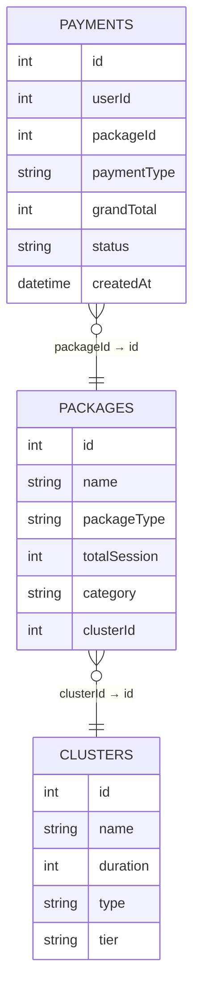

# 📊 Counseling Transaction SQL & Dashboard Analysis

Analisis data transaksi layanan konseling & meditasi menggunakan **PostgreSQL** untuk menjawab kebutuhan bisnis melalui query SQL, kemudian divisualisasikan menggunakan **Looker Studio** dalam bentuk dashboard interaktif yang mudah dipahami oleh stakeholder.

---

# 🏢 Business Context

Sebuah platform layanan **konseling** dan **meditasi** ingin memahami performa transaksi, perilaku pelanggan, serta kontribusi masing-masing layanan terhadap pendapatan perusahaan.

Data transaksi yang tersedia masih berupa database relasional sehingga diperlukan proses analisis menggunakan SQL untuk menjawab beberapa pertanyaan bisnis, kemudian menyajikan hasilnya dalam bentuk dashboard yang dapat digunakan oleh stakeholder non-teknis.

---

# 🎯 Project Objectives

Project ini bertujuan untuk:

- Mengidentifikasi pelanggan dengan total pengeluaran (spend) tertinggi.
- Menganalisis total penjualan setiap cluster layanan berdasarkan tahun.
- Menentukan paket dengan performa penjualan terbaik pada masing-masing jenis layanan.
- Menyajikan hasil analisis dalam dashboard interaktif untuk mendukung proses pengambilan keputusan.

---

# 📂 Dataset Overview

Dataset berasal dari **Database.xlsx** yang terdiri dari tiga tabel relasional.

| Tabel | Jumlah Data | Deskripsi |
| --- | ---: | --- |
| Payments | 16.603 | Data transaksi pembayaran pelanggan |
| Packages | 81 | Master data paket layanan |
| Clusters | 18 | Master kategori layanan konseling |

Periode data:

**Januari 2024 – Desember 2025**

Total pengguna unik:

**10.103 pengguna**

---

# 🗄 Database Schema



Hubungan antar tabel:

- **Payments** menyimpan seluruh transaksi pelanggan.
- **Packages** berisi informasi paket yang dibeli.
- **Clusters** menyimpan kategori layanan konseling.

Karena informasi cluster tidak tersedia langsung pada tabel transaksi, analisis tertentu memerlukan proses **multi-table JOIN**.

---

# 🔄 Analytical Workflow

```text
📥 Database.xlsx
        │
        ▼
🔍 Data Understanding
        │
        ▼
🗂 Relationship Analysis
        │
        ▼
💻 SQL Query Development
        │
        ▼
📊 Business Analysis
        │
        ▼
📈 Dashboard Development
        │
        ▼
💡 Business Insights
```

---

# 📌 Business Question 1

## Siapa pelanggan dengan total pengeluaran (spend) tertinggi?

### Analytical Approach

- Menggunakan hanya transaksi dengan status **success**
- Mengelompokkan transaksi berdasarkan **userId**
- Menjumlahkan seluruh nilai transaksi menggunakan **SUM(grandTotal)**
- Mengurutkan berdasarkan total pengeluaran terbesar
- Menampilkan **10 pelanggan teratas**

### SQL Concepts

- WHERE
- GROUP BY
- SUM()
- ORDER BY
- LIMIT

📄 Query:

`SQL/(1) Top Spender User.sql`

### Business Insight

Analisis ini membantu mengidentifikasi pelanggan dengan nilai transaksi tertinggi yang berpotensi menjadi target program loyalitas maupun penawaran layanan premium.

---

# 📌 Business Question 2

## Bagaimana performa penjualan setiap cluster layanan pada tiap tahun?

### Analytical Approach

- Memfilter transaksi dengan status **success**
- Melakukan **JOIN** antara tabel Payments, Packages, dan Clusters
- Mengekstrak tahun transaksi menggunakan **EXTRACT(YEAR)**
- Menghitung total penjualan setiap cluster
- Mengurutkan berdasarkan tahun dan total penjualan

### SQL Concepts

- LEFT JOIN
- EXTRACT()
- GROUP BY
- ORDER BY
- Aggregation

📄 Query:

`SQL/(2) Total Penjualan per Cluster per Tahun.sql`

### Business Insight

Hasil analisis menunjukkan kontribusi masing-masing cluster terhadap pendapatan perusahaan pada setiap tahun sehingga dapat digunakan sebagai dasar evaluasi performa layanan.

---

# 📌 Business Question 3

## Paket apa saja yang memiliki penjualan tertinggi pada setiap jenis layanan?

### Analytical Approach

- Menghitung total penjualan setiap paket
- Mengelompokkan berdasarkan **packageType**
- Menggunakan **ROW_NUMBER()** untuk membuat ranking
- Menampilkan tiga paket terbaik pada setiap kategori

### SQL Concepts

- Window Function
- ROW_NUMBER()
- PARTITION BY
- LEFT JOIN
- Subquery

📄 Query:

`SQL/(3) Penjualan Paket Tertinggi per packageType.sql`

### Business Insight

Analisis ini membantu perusahaan mengetahui paket dengan performa terbaik pada masing-masing kategori layanan sehingga dapat menjadi acuan strategi promosi maupun pengembangan produk.

---

# 📊 Dashboard Overview

Seluruh hasil analisis kemudian divisualisasikan menggunakan **Looker Studio** agar lebih mudah dipahami oleh stakeholder non-teknis.

Dashboard dapat diakses melalui:

🔗 https://datastudio.google.com/reporting/b8844fa7-c77a-48ba-86d6-f3c3573891c7

---

# 🖼 Dashboard Preview

<p align="center">

</p>

---

# 📈 Dashboard Features

Dashboard menampilkan berbagai metrik utama, di antaranya:

- Total Revenue
- Total Transactions
- Unique Users
- Average Transaction Value
- Revenue by Package Type
- Revenue by Cluster Type
- Transaction Status Distribution
- Top Users by Spending
- Interactive Filters (Tanggal, Status, Package Type, Counseling Type)

---

# 💡 Key Findings

Beberapa insight utama yang diperoleh dari hasil analisis:

- Paket **konseling** menghasilkan total revenue tertinggi dibandingkan jenis layanan lainnya.
- Sekitar **74,8% transaksi berhasil diselesaikan**, menunjukkan mayoritas pembayaran berstatus sukses.
- Terdapat perbedaan performa revenue yang cukup signifikan antar cluster layanan.
- Sejumlah pengguna memiliki nilai transaksi jauh di atas rata-rata sehingga berpotensi menjadi pelanggan loyal.

---

# 📁 Repository Structure

```text
.
├── Data/
│   └── Database.xlsx
│
├── SQL/
│   ├── (1) Top Spender User.sql
│   ├── (2) Total Penjualan per Cluster per Tahun.sql
│   └── (3) Penjualan Paket Tertinggi per packageType.sql
│
├── Dashboard/
│   ├── looker_studio_link.md
│   └── assets/
│       └── dashboard_preview.png
│
└── README.md
```

---

# 🛠 Tools

- PostgreSQL
- DBeaver
- Looker Studio
- Google Sheets
- Microsoft Excel

---

# 💼 Skills Demonstrated

### 📊 Data Analysis

- Exploratory Data Analysis
- Business Analysis
- KPI Analysis
- Data Interpretation

### 🗄 SQL

- Multi-table JOIN
- Aggregation
- Window Functions
- Ranking
- Filtering
- Data Transformation

### 📈 Business Intelligence

- Dashboard Development
- Interactive Reporting
- Data Visualization
- Business Reporting

---

# 🚀 Conclusion

Melalui project ini, data transaksi layanan konseling berhasil dianalisis menggunakan SQL untuk menjawab tiga kebutuhan bisnis utama, kemudian diterjemahkan menjadi dashboard interaktif yang mudah dipahami oleh stakeholder.

Selain menghasilkan visualisasi yang informatif, project ini juga menunjukkan proses analisis data berbasis database relasional, mulai dari memahami struktur data, membangun query SQL, hingga menyampaikan insight dalam bentuk yang siap digunakan sebagai pendukung pengambilan keputusan.
