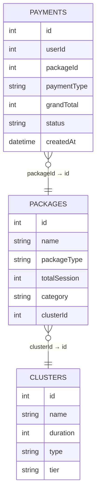
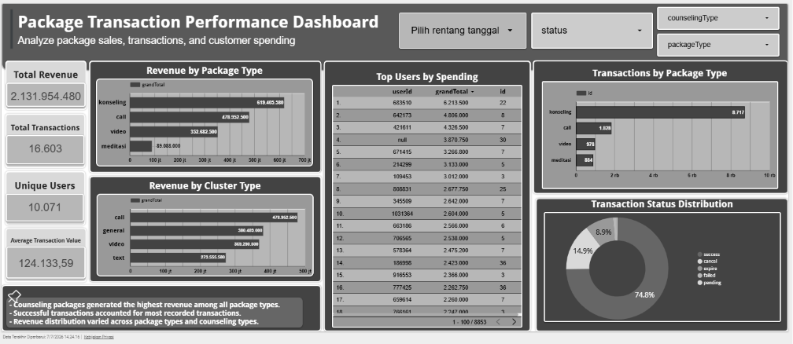

# Counseling Transaction SQL & Dashboard Analysis

Analisis data transaksi layanan konseling & meditasi menggunakan SQL, divisualisasikan lewat dashboard interaktif Looker Studio.

## Konteks

Dataset ini berisi **16.603 transaksi** dari **10.103 user** sepanjang **Januari 2024 – Desember 2025**, mencakup pembelian paket konseling (call, video, chat) dan meditasi. Project ini menjawab beberapa pertanyaan bisnis lewat query SQL, sekaligus menerjemahkan angka mentah menjadi dashboard yang enak dibaca oleh stakeholder non-teknis.

## Dataset

Sumber: [`Database.xlsx`](Data/Database.xlsx) — 3 tabel relasional:

| Tabel | Baris | Deskripsi |
|---|---|---|
| `Payments` | 16.603 | Transaksi user: paket yang dibeli, nominal, status, waktu |
| `Packages` | 81 | Master paket layanan: jenis (call/video/konseling/meditasi), kategori (basic/premium) |
| `Clusters` | 18 | Master kategori konselor: tipe layanan, tier (junior/senior) |

**Relasi antar tabel:**



**Sekilas kondisi data** (jadi konteks kenapa query ditulis seperti ini):
- Distribusi status transaksi timpang: `success` (74.8%), `cancel` (14.9%), `expire` (8.9%), `failed` (1.1%), `pending` (0.2%) — perlu filter status yang tepat tiap soal agar angka nggak bias.
- Total revenue dari transaksi sukses: **~Rp 1,54 miliar**.
- `Packages.clusterId` ada yang kosong (null) — dipertimbangkan saat JOIN ke `Clusters` supaya tidak kehilangan data lewat inner join yang terlalu ketat.

## Struktur Repo

```
.
├── Data/
│   └── Database.xlsx          # Dataset mentah (Payments, Packages, Clusters)
├── SQL/
│   ├── (1) Top Spender User.sql
│   ├── (2) Total Penjualan per Cluster per Tahun.sql
│   └── (3) Penjualan Paket Tertinggi per packageType.sql
├── Dashboard/
│   ├── looker_studio_link.md  # Link dashboard + ringkasan isinya
│   └── assets/
│       └── dashboard_preview.png
└── README.md
```

## Pertanyaan Bisnis & Query

| No | Pertanyaan Bisnis | Query |
|---|---|---|
| 1 | Siapa user dengan total pengeluaran (spend) tertinggi dari seluruh periode data, dihitung hanya dari transaksi `success`? | [`SQL/(1) Top Spender User.sql`](<SQL/(1) Top Spender User.sql>) |
| 2 | Berapa total penjualan per cluster pada tiap tahun, diurutkan berdasarkan tahun (ascending) lalu total penjualan tertinggi (descending)? | [`SQL/(2) Total Penjualan per Cluster per Tahun.sql`](<SQL/(2) Total Penjualan per Cluster per Tahun.sql>) |
| 3 | Apa 3 paket dengan total penjualan tertinggi di masing-masing `packageType`, dihitung dari seluruh periode data? | [`SQL/(3) Penjualan Paket Tertinggi per packageType.sql`](<SQL/(3) Penjualan Paket Tertinggi per packageType.sql>) |

Dialek: **PostgreSQL**. Setiap query disertai comment satu baris untuk syntax yang dianggap penting (window function, join logic, date casting, dsb).

**Highlight teknis dari tiap query:**
- **Soal 1** — agregasi sederhana dengan `GROUP BY` + `ORDER BY ... LIMIT`, filter status di level `WHERE`.
- **Soal 2** — multi-table join (`payments → packages → clusters`) karena relasi cluster tidak langsung ke payments, plus `EXTRACT(YEAR FROM ...)` dengan cast eksplisit karena kolom tanggal masih bertipe varchar.
- **Soal 3** — window function `ROW_NUMBER() OVER (PARTITION BY ...)` di dalam subquery untuk ranking per kategori, dikombinasikan dengan `LEFT JOIN` supaya package tanpa match tetap tampil.

## Dashboard

📊 **[Buka Dashboard Looker Studio](https://datastudio.google.com/reporting/b8844fa7-c77a-48ba-86d6-f3c3573891c7)**



**Package Transaction Performance Dashboard** — ringkasan performa penjualan paket, transaksi, dan spending customer dalam satu tampilan.

**Key Metrics:**
| Metric | Nilai |
|---|---|
| Total Revenue | Rp 2.131.954.480 |
| Total Transactions | 16.603 |
| Unique Users | 10.071 |
| Average Transaction Value | Rp 124.133,59 |

**Isi Dashboard:**
- **Revenue by Package Type** — `konseling` menghasilkan revenue tertinggi (Rp 619,4 jt), diikuti `call`, `video`, dan `meditasi` paling rendah.
- **Revenue by Cluster Type** — cluster `call` memimpin revenue (Rp 479,3 jt), disusul `general`, `video`, `text`.
- **Top Users by Spending** — tabel ranking user berdasarkan `grandTotal`, lengkap dengan `userId`.
- **Transactions by Package Type** — `konseling` juga mendominasi dari sisi jumlah transaksi (8.717), jauh di atas `call`, `video`, `meditasi`.
- **Transaction Status Distribution** — donut chart: `success` 74,8%, `cancel` 14,9%, `expire` 8,9%, sisanya `failed` & `pending`.
- **Filter Interaktif** — rentang tanggal, `status`, `counselingType`, dan `packageType`, jadi dashboard bisa dieksplorasi sesuai kebutuhan.

**Insight utama:**
- Paket konseling menghasilkan revenue tertinggi di antara semua jenis paket.
- Mayoritas transaksi yang tercatat berstatus sukses (74,8%).
- Distribusi revenue cukup bervariasi antar jenis paket maupun jenis konseling.

## Tools

- **Database**: PostgreSQL
- **SQL Client**: DBeaver
- **Visualisasi**: Looker Studio
- **Sumber data**: Google Sheets / Excel ([`Database.xlsx`](Data/Database.xlsx))
