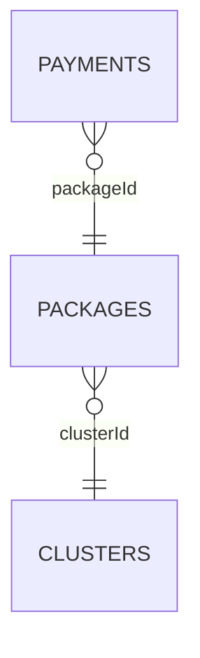

# 📊 Counseling Transaction SQL & Dashboard Analysis

Analisis data transaksi layanan konseling & meditasi menggunakan **PostgreSQL** untuk menjawab tiga business question pada studi kasus Data Analyst, kemudian divisualisasikan menggunakan **Looker Studio** agar insight lebih mudah dipahami oleh stakeholder.

---

# 🏢 Business Context

Project ini merupakan penyelesaian **Take Home Test – Data Analyst (Study Case 1)** yang berfokus pada analisis data transaksi layanan konseling dan meditasi.

Dataset terdiri dari tiga tabel relasional (Payments, Packages, dan Clusters). Melalui SQL, project ini menjawab tiga business question utama dan menyajikan hasil analisis dalam dashboard interaktif.

---

# 🎯 Project Objectives

- Menjawab tiga business question menggunakan SQL.
- Mengolah data relasional melalui JOIN, agregasi, dan window function.
- Menghasilkan insight bisnis dari data transaksi.
- Menyajikan hasil analisis dalam dashboard interaktif.

---

# 📂 Dataset Overview

| Tabel | Jumlah Data | Deskripsi |
| --- | ---: | --- |
| Payments | 16.603 | Data transaksi pembayaran |
| Packages | 81 | Master data paket |
| Clusters | 18 | Master data cluster layanan |

**Periode data:** Januari 2024 – Desember 2025

---

# 🗄 Database Schema



---

# 🔄 Analytical Workflow

```text
Database.xlsx
      │
      ▼
Data Understanding
      │
      ▼
Relationship Analysis
      │
      ▼
SQL Query Development
      │
      ▼
Business Analysis
      │
      ▼
Looker Studio Dashboard
      │
      ▼
Business Insight
```

---

# 📌 Business Question 1

## Top Spender User

### Analytical Approach

- Filter transaksi `success`
- Hitung total spend menggunakan `SUM(grandTotal)`
- Kelompokkan berdasarkan `userId`
- Urutkan dari terbesar
- Ambil 10 user teratas

### 🧠 SQL Concepts Applied

- WHERE
- GROUP BY
- SUM()
- ORDER BY
- LIMIT

### 📄 SQL Solution

➡️ **[(1) Top Spender User.sql](<SQL/(1) Top Spender User.sql>)**

### 💡 Business Insight

Mengidentifikasi pelanggan dengan nilai transaksi tertinggi sebagai kandidat program loyalitas maupun layanan premium.

---

# 📌 Business Question 2

## Total Penjualan per Cluster per Tahun

### Analytical Approach

- Filter transaksi `success`
- Melakukan **JOIN** antara tabel Payments, Packages, dan Clusters
- Melakukan casting `createdAt` dari **VARCHAR** menjadi **TIMESTAMP**
- Mengambil tahun menggunakan `EXTRACT(YEAR)`
- Menghitung total penjualan tiap cluster
- Mengurutkan berdasarkan tahun dan total penjualan

### 🧠 SQL Concepts Applied

- JOIN
- EXTRACT()
- GROUP BY
- SUM()
- ORDER BY
- Type Casting (`::timestamp`)

### 📄 SQL Solution

➡️ **[(2) Total Penjualan per Cluster per Tahun.sql](<SQL/(2) Total Penjualan per Cluster per Tahun.sql>)**

### 💡 Business Insight

Membandingkan performa penjualan setiap cluster pada masing-masing tahun sehingga memudahkan evaluasi kontribusi layanan.

---

# 📌 Business Question 3

## Top 3 Package pada Setiap Package Type

### Analytical Approach

- Hitung total penjualan tiap package
- Kelompokkan berdasarkan `packageType`
- Gunakan `ROW_NUMBER() OVER(PARTITION BY ...)`
- Ambil tiga package terbaik di setiap kategori

### 🧠 SQL Concepts Applied

- LEFT JOIN
- Window Function
- ROW_NUMBER()
- PARTITION BY
- GROUP BY
- CASE
- Subquery

### 📄 SQL Solution

➡️ **[(3) Penjualan Paket Tertinggi per packageType.sql](<SQL/(3) Penjualan Paket Tertinggi per packageType.sql>)**

### 💡 Business Insight

Menunjukkan paket dengan performa penjualan terbaik pada setiap kategori layanan sehingga dapat menjadi dasar evaluasi produk.

---

# 📊 Dashboard

Dashboard dibangun menggunakan **Looker Studio** berdasarkan dataset yang sama untuk menyajikan ringkasan performa transaksi secara visual.

👉 **https://datastudio.google.com/reporting/b8844fa7-c77a-48ba-86d6-f3c3573891c7**

## Dashboard Features

- Revenue Overview
- Revenue by Package Type
- Revenue by Cluster
- Transaction Status Distribution
- Top Users by Spending
- Interactive Filters

---

# 📂 Repository Structure

```text
.
├── Data/
│   └── Database.xlsx
├── SQL/
│   ├── (1) Top Spender User.sql
│   ├── (2) Total Penjualan per Cluster per Tahun.sql
│   └── (3) Penjualan Paket Tertinggi per packageType.sql
├── Dashboard/
│   ├── assets/
│   │   └── dashboard_preview.png
│   └── looker_studio_link.md
├── .gitignore
├── LICENSE
└── README.md
```

---

# 🛠 Tools

- PostgreSQL
- DBeaver
- Looker Studio
- Microsoft Excel / Google Sheets
- Git & GitHub

---

# 💼 Skills Demonstrated

- SQL
- Data Analysis
- Business Analysis
- Relational Database
- Window Function
- Data Aggregation
- Dashboard Development
- Data Visualization

---

# 🚀 Conclusion

Project ini menunjukkan proses analisis data relasional mulai dari memahami struktur database, menyusun query SQL untuk menjawab kebutuhan bisnis, hingga menyajikan hasil analisis dalam dashboard interaktif. Selain menghasilkan insight, project ini juga mendemonstrasikan penerapan konsep SQL seperti JOIN, agregasi, type casting, dan window function dalam studi kasus Data Analyst.
